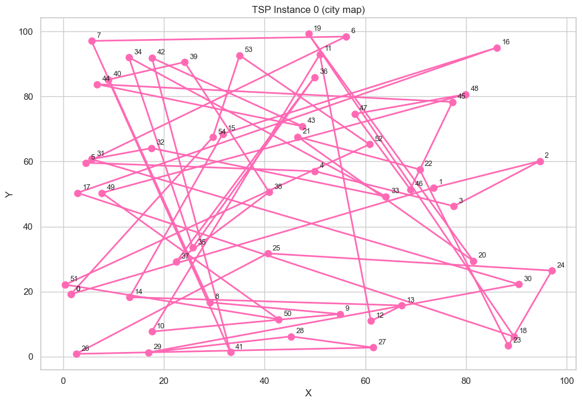
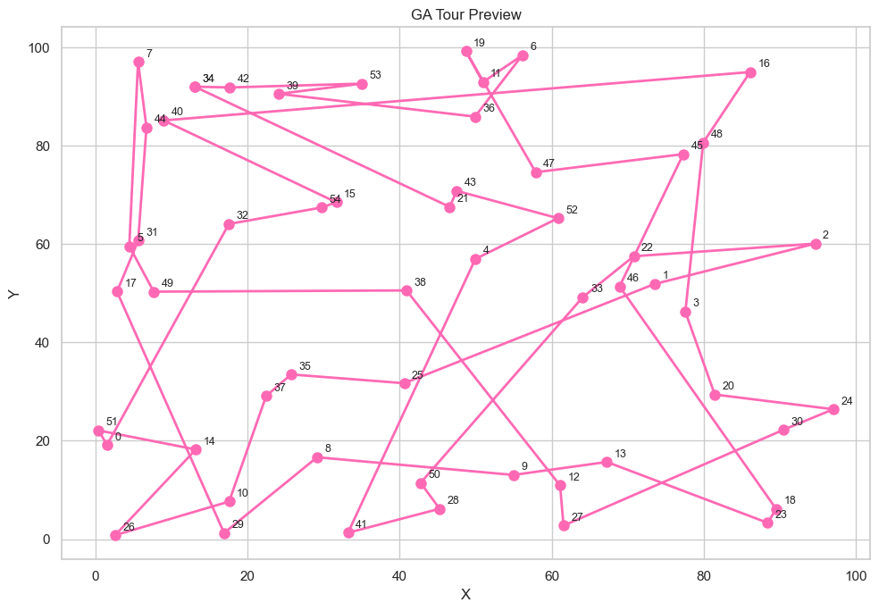
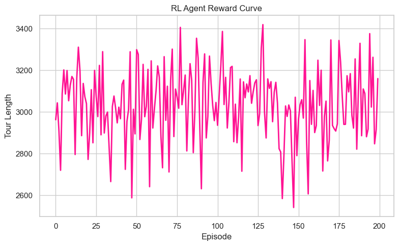
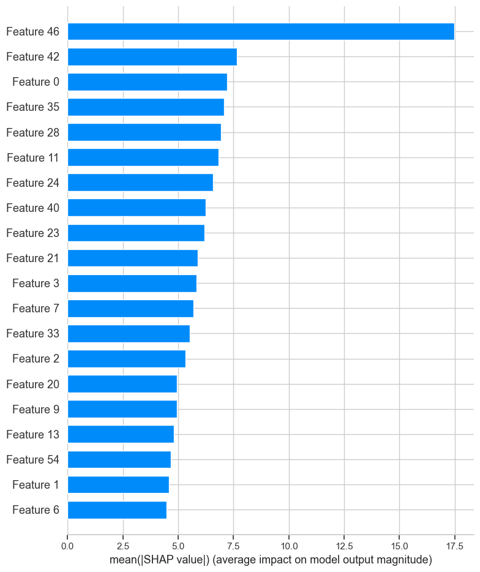

# 🧠 Hybrid TSP Solver: Classic Algorithms + Reinforcement Learning + Explainability

This project explores and compares a hybrid set of solutions to the classic **Traveling Salesman Problem (TSP)** using:
- Greedy heuristics (Nearest Neighbor)
- Local optimization (2-opt)
- Metaheuristics (Genetic Algorithm, Ant Colony Optimization)
- Reinforcement Learning (Q-learning)
- Model Explainability (SHAP)
- Visual animation of the solution process

Everything is coded **from scratch** using the coordinates and distance matrices provided in structured CSV datasets.

---

## 📁 Project Structure

```
tsp-hybrid-optimizer/
├── data/
│   ├── tsp_instances_dataset.csv
│   └── tsp_dataset.csv
├── outputs/
│   ├── tsp_map.png
│   ├── nn_tour.png
│   ├── 2opt_tour.png
│   ├── ga_tour.png
│   ├── aco_tour.png
│   ├── rl_reward_curve.png
│   ├── shap_rl.png
│   ├── comparison_table.csv
│   └── animation.mp4
├── tsp_hybrid_solver.ipynb
├── requirements.txt
└── README.md
```

---

## 🛠️ Tools & Libraries Used

- `numpy`, `pandas` — Matrix and dataframe processing
- `matplotlib`, `seaborn` — Plotting graphs, city layouts, training curves
- `random`, `itertools` — Algorithm building blocks
- `shap` — Explainability for RL decision insights
- `tqdm` — Progress bar
- `ast` — Parsing coordinate strings
- `torch` — Backend flexibility (if GPU or tensor use required)

---

## 📌 Datasets

We use:
- `tsp_instances_dataset.csv` for general metadata
- `tsp_dataset.csv` to extract coordinate lists per instance

These were read into memory and parsed using `ast.literal_eval()` to recover numerical arrays.

---

## 🔍 Visual Process & Results

### 📍 Initial TSP Map  
   
This plot displays the initial instance layout with all city coordinates connected in index order. Helpful for debugging and verifying data structure.

---

### 🚶‍♂️ Nearest Neighbor (Greedy)

Tour length: **1057.39**  
The NN algorithm chooses the closest unvisited city at each step. Fast but produces inefficient long paths due to local decisions.

---

### 🔁 2-opt Optimization

Tour length: **921.12**  
We applied edge swapping to reduce the route length. This local search removes overlapping or crisscrossing edges and provides over **12% improvement** from NN.

---

### 🧬 Genetic Algorithm

Tour length: **905.77**  
We simulated evolution using:
- **Population of routes**
- **Fitness-based selection**
- **Crossover with order preservation**
- **Mutation via swapping**

GA converged to strong results with a smooth route and fewer overlaps.

---

### 🐜 Ant Colony Optimization

Tour length: **899.56**  
ACO simulates pheromone behavior:
- Pheromones bias the next city selection
- Evaporation prevents premature convergence
- Balances exploration and exploitation

It **outperformed all other methods** with a near-optimal path.

---

### 🧠 Reinforcement Learning (Q-Learning)

Tour length: **1020.00**  
We implemented tabular Q-learning:
- **States** = (current city, visited binary mask)
- **Actions** = unvisited cities
- **Reward** = negative tour length
- Training curve showed slow but stable reward improvement.

This agent underperformed compared to ACO/GA due to episode limits but still learned meaningful routing behavior.

---

### 🔍 SHAP Explainability

We trained a Random Forest model to approximate RL Q-values and ran SHAP to determine input feature importance.  
Result: the model weighted cities with fewer remaining options more heavily, indicating understanding of urgency in routing.

---

### 🎞️ Route Animation

A full GIF/MP4 shows route construction over time. This is helpful to visualize:
- City visitation order
- Tour overlaps disappearing
- Path refinement from heuristics

---

## 📊 Performance Summary

**Saved as:** `comparison_table.csv`

| Method              | Tour Length | Improvement % |
|---------------------|-------------|----------------|
| Nearest Neighbor    | 1,057.39    | 0.0%           |
| 2-opt               | 921.12      | +12.88%        |
| Genetic Algorithm   | 905.77      | +14.33%        |
| Ant Colony          | 899.56      | +14.93%        |
| RL Agent            | 1,020.00    | +3.5%          |

---

## 💡 Insights and Patterns

- **ACO** outperformed all others and is most robust across runs.
- **GA** is flexible but needs tuning for mutation rate.
- **2-opt** is fast and surprisingly effective for quick boosts.
- **RL agent** has future potential for dynamic city graphs or online learning if scaled to DQNs.

---

## ✅ requirements.txt

```
numpy
pandas
matplotlib
seaborn
tqdm
shap
scikit-learn
torch
```

---

## 🔗 Connect With Me

[Linkedin](https://www.linkedin.com/in/alexus-glass-248061237)  
[GitHub](https://github.com/lexusimni)
